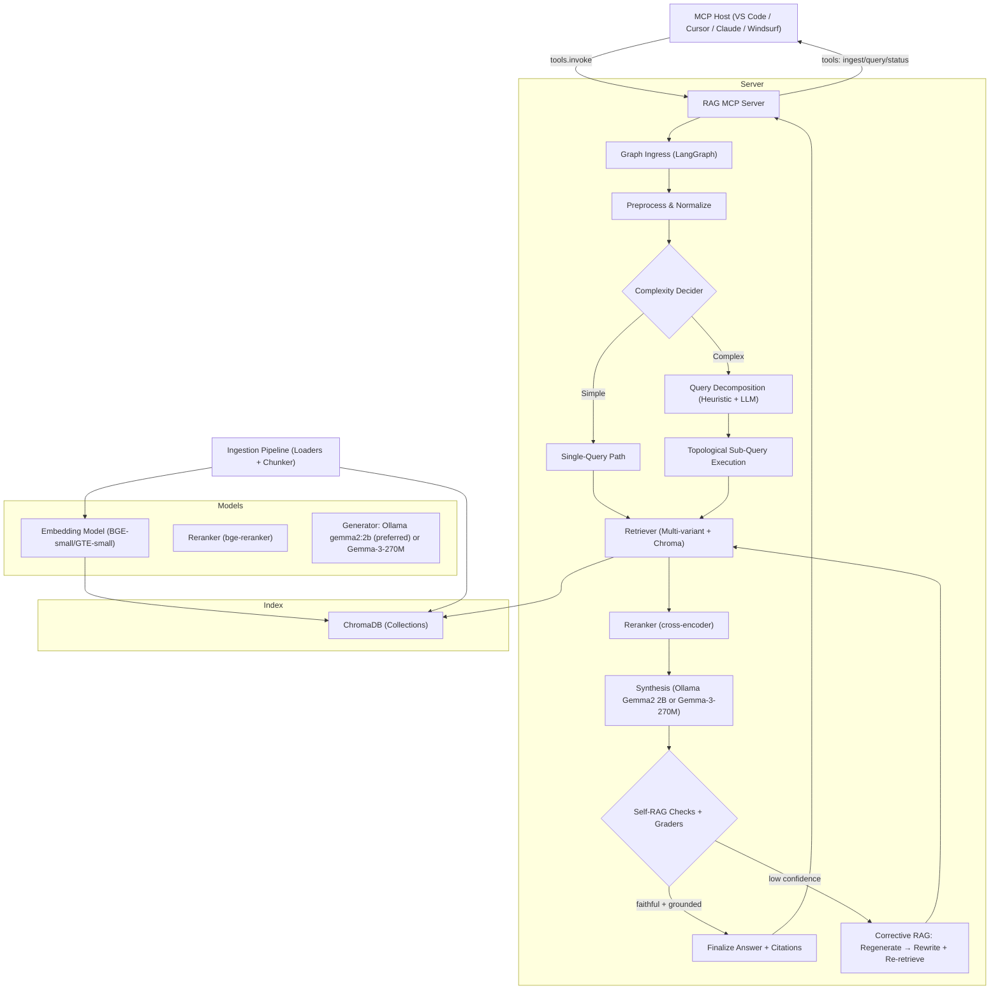
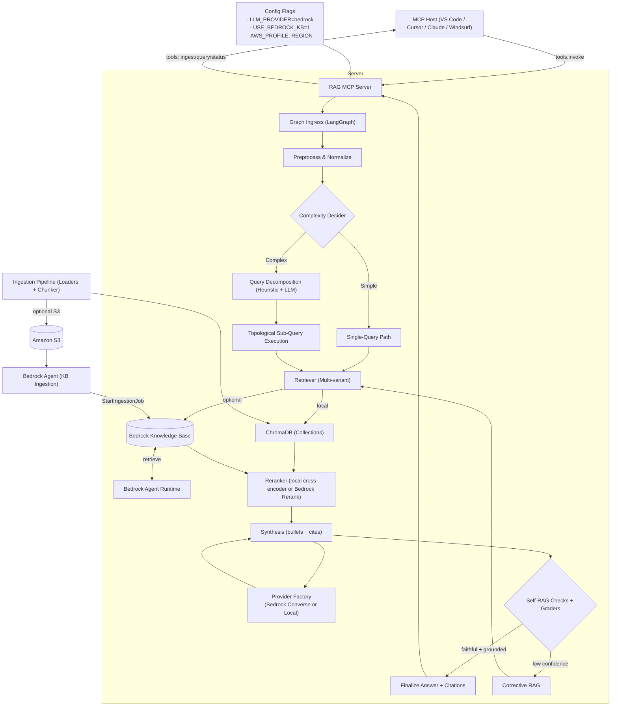

## Checklist (High-Level)
- Define scope, goals, and non-goals from references (MCP exposure, Self-RAG, Corrective RAG)
- Design end-to-end architecture (nodes, data stores, control flow) with separation of concerns
- Specify MCP interface (tool names, I/O) and LangGraph pipeline (nodes, state, policies)
- Choose models/indexes; define retrieval (hybrid + rerank) and agentic logic (decider, decomposition)
- Document deployment/configuration/operations (observability, performance, offline)
- Address security/privacy and safe-generation constraints

---

## System Overview
A self-contained Retrieval-Augmented Generation (RAG) system that:
- Exposes capabilities via MCP to integrate with VS Code, Cursor, Claude Desktop, or Windsurf.
- Uses a custom, agentic RAG pipeline with Self-RAG and Corrective RAG elements: hybrid retrieval, reranking, complexity detection, query decomposition, iterative correction.
- Runs locally with `google/gemma-3-270m` for generation, a compact embedding model, and ChromaDB for vector storage and retrieval (with optional keyword prefilters).

Status: Defined scope and objectives. Next: Architecture diagram.

---

## Architecture Diagram (textual/visual)

Status: Created top-level architecture diagram. Next: Component descriptions.

---

## Component Descriptions
### MCP Interface
- Tools
  - `rag.query`
    - Input: `{ query: string, k?: number, max_tokens?: number, stream?: boolean, metadata_filters?: object }`
    - Streamed events: `{ type: 'partial'|'final'|'citation'|'debug'|'error', data: any }`
  - `rag.ingest`
    - Input: `{ paths?: string[], urls?: string[], glob?: string, tags?: string[] }`
    - Output: `{ docs_ingested: number, chunks: number, duration_ms: number }`
  - `rag.status`
    - Output: `{ num_docs: number, num_chunks: number, chroma_collection_size: number, last_ingest_at?: string }`
  - `rag.reindex`
    - Input: `{ rebuild?: boolean, vacuum?: boolean }`
    - Output: `{ status: 'ok', stats: Record<string, number> }`
  - `rag.clear`
    - Input: `{ scope: 'all'|'by_tag', tag_contains?: string }`
    - Output: `{ status: 'ok', chroma_collection_size: number }`
  - `rag.export`
    - Input: `{ path: string, limit?: number }` (exports JSONL)
    - Output: `{ status: 'ok', path: string, rows: number }`
- Behavior
  - Streaming partial tokens and structured citation events.
  - Deterministic error objects with `code`, `message`, and `hint`.

Status: Specified MCP tools and I/O schemas. Next: RAG core pipeline.

### RAG Core (LangGraph)
- Nodes
  - Preprocess: normalization, stopword-lite; detect constraints (time ranges, tags).
  - ComplexityDecider: heuristic cues + entity count to route simple vs complex.
  - QueryDecomposition: heuristic split plus LLM JSON planner (2–6 sub-queries with depends_on and type).
  - MultiRetrieve: multi-variant retrieval (original + keyword-expanded) fused via RRF; Chroma similarity.
  - Reranker: cross-encoder reranks to top K_context.
  - Synthesis: generation with bullet/citation enforcement and short-quote injection; extractive fallback.
  - SelfRAGChecks: faithfulness (keyword/quote overlap), citation presence, simple coverage score.
  - Graders: hallucination (faithful + cited fraction), relevance (keyword overlap with summarize intent).
  - CorrectiveRAG: two-phase loop (regenerate N times on hallucination; then rewrite and re-retrieve M times).
- State
  - `RunState`: `{ query, rewritten_query?, sub_queries?, hits[], reranked[], context_chunks[], answer?, citations[], confidence }`.
- Policies
  - Early exit when confidence ≥ threshold.
  - Guardrails: max time, max iterations, fallbacks to lexical-only.

Status: Outlined LangGraph nodes and state. Next: Retrieval engine.

### Retrieval Engine
- Ingestion
  - Loaders: markdown, txt, pdf, html, docx; extract `title`, `section_hierarchy`, `page`.
  - Chunking: heading-aware + token window 256–512, stride 64–128; store checksums for dedupe.
- Indexes
  - ChromaDB: persistent client with one collection per corpus/scope. Store `id = chunk_id`, `documents = chunk text`, `metadatas = { doc_id, source_uri, section, page, tags, checksum, created_at }`, and embeddings from the chosen encoder.
- Retrieval
  - Vector similarity fetch from Chroma for top_k (cosine or inner product). Optionally run multiple variants: original query, keyword-only, and rewritten query; fuse scores via weighted sum or Reciprocal Rank Fusion across variants.
  - Deduplicate by `chunk_id`; cap to `K_merge`; rerank to `K_context` (6–12) via cross-encoder.
  - Context packing: greedy by token budget with document diversity.

Status: Defined ingestion, indexing, and retrieval mechanics. Next: Complexity decider.

### Complexity Decider
- Heuristics
  - Multi-hop cues (compare, vs, pros/cons, steps, timeline), entity count > 2, temporal span phrases.
- LLM tiebreaker
  - Gemma classification prompt returns `Simple|Complex` + brief rationale.
- Output
  - `{ label: 'Simple'|'Complex', reason: string }`, thresholded to reduce false positives.

Status: Complexity logic captured. Next: Query decomposition.

### Query Decomposition
- Prompted plan
  - Produce 2–6 sub-queries: `{ id, text, depends_on: string[], type: 'lookup'|'synthesis' }`.
- Execution
  - Topological order by dependencies; independent lookups may run in small batches; intermediate facts fed forward.
- Aggregation
  - Per-subquery synthesis; remap local [#i] citations to a global merged index; group bullets into sections (Compare, Usage, Summary); cap per-section bullets for concise outputs; Self‑RAG validates.

Status: Decomposition spec done. Next: LLM integration.

### LLM Integration (Ollama Gemma2 2B / Gemma-3-270M)
- Preferred generator: `gemma2:2b` via Ollama for improved fluency and stability.
- Alternative: `google/gemma-3-270m-instruct` via `transformers` (gated); or local GGUF + Modelfile.
- Generation
  - Controlled prompts: answer-first outline, then fill with grounded quotes; constrained max tokens (512–768).
  - Output includes `text`, `citations`, `confidence`.
- Efficiency
  - Load once; reuse tokenizer; low temperature; caching where safe.
- Limitations
  - Small model—compensate with strong retrieval/rerank and strict self-checks.

Status: Finalized model integration and generation strategy. Next: Data flow.

---

## Data Flow
- Simple path
  1) Preprocess → ComplexityDecider = Simple
  2) Retrieve via ChromaDB similarity (optionally fusing query variants) → cross-encoder rerank → context packing
  3) Generate with citation slots → Self-RAG pass
  4) If confidence high → finalize; else → CorrectiveRAG loop up to 2 retries
- Complex path
  1) Preprocess → ComplexityDecider = Complex → Heuristic + LLM Decompose
  2) Execute plan in topological order: for each sub-query retrieve → rerank → synthesize snippet
  3) Remap citations to global indices; group bullets into Compare/Usage/Summary; Self‑RAG + Graders
  4) Corrective loop: regenerate on hallucination fail; rewrite + re-retrieve on relevance fail
- Citations
  - Chunk-level IDs and quote spans returned; host can render expandable snippets.

Status: Documented control and data flow. Next: External integrations.

---

## External Integrations
- MCP Hosts: VS Code, Cursor, Claude Desktop, Windsurf via MCP tool registration.
- Vector Store: ChromaDB local persistent client (collection per corpus). Managed via `rag.reindex`/maintenance commands.
- Models: Local HF models (Gemma, embedding, reranker) cached under `~/.cache/huggingface`; optional vendoring for offline.
- File loaders: `pypdf`, `beautifulsoup4`, `python-docx`, markdown parser.
 - Web search fallback (host-driven): when internal relevance remains low after corrective attempts, server returns a `next_action` advising to use the existing `web-search` MCP tool (`search`) with `{query, limit}`.

Status: Listed external dependencies and connections. Next: Deployment notes.

---

## Deployment Notes
- Runtime
  - Python 3.10+; CPU-only; macOS/Linux. Memory: ~1–2 GB depending on corpus size.
- Packaging
  - `requirements.txt` with pinned versions; optional `uv`/`pip-tools`.
- Directory layout
  - `mcp_server/`, `graph/`, `index/` (e.g., `chroma_store.py`), `models/`, `config/`, `cli/`, `tests/`.
- Start
  - Launch MCP server entrypoint (e.g., `python -m mcp_server.server`); register with host via MCP config.
- CLI
  - `cli/rag.py` provides local `ingest` and `query` commands for smoke testing.
- Offline
  - Pre-download models; bundle in app package for air-gapped install if needed.
- Observability
  - Structured logs (JSON), run traces, ingestion stats; optional `rag.export`.

Status: Added deploy and ops guidance. Next: Configuration parameters.

---

## Configuration Parameters
- General
  - `embedding_model`: default `BAAI/bge-small-en-v1.5`
  - `reranker_model`: default `BAAI/bge-reranker-base`
  - `llm_model`: `google/gemma-3-270m-instruct`
- Retrieval
  - `top_k_dense`: 50; `top_k_lexical`: 50; `k_rrf`: 60; `k_merge`: 50; `k_context`: 10
  - `token_budget`: 1400; `max_gen_tokens`: 640; `temperature`: 0.3
- Chunking
  - `target_chunk_tokens`: 384; `stride_tokens`: 96; `min_chunk_chars`: 300
- Agentic
  - `complexity_threshold`: heuristic count (≥2) triggers LLM vote
  - `selfrag_conf_threshold`: 0.6; `relevance_threshold`: 0.2
  - `max_regen_attempts`: 1; `max_rewrite_attempts`: 2
- Storage
  - `chroma_persist_dir`: path to Chroma persistence; `chroma_collection`: collection name; `cache_dir`: model cache
- Feature flags
  - `enable_generation` (env `RAG_MCP_ENABLE_GENERATION`): when false, skip model load; use extractive fallback
  - `use_ollama` and `ollama_model` (e.g., `gemma2:2b`)
  - `use_extractive_summary`, `summary_bullets_min`, `summary_bullets_max`
- Ingestion
  - `include_glob`: patterns; `tags`: default tags; `dedupe`: true

Status: Declared tunable parameters with defaults. Next: Security & privacy.

---

## Security and Privacy Considerations
- Data locality
  - All processing and indexes are local; no network calls at query time when models are pre-fetched.
- PII handling
  - Avoid logging raw content; redact quotes in logs; store minimal metadata in traces.
- Access control
  - File ingestion restricted to user-specified directories; safe path resolution; optional symlink ignore.
- Model governance
  - Vendor models with checksums; verify integrity on load.
- Sandboxing
  - Validate MCP inputs; enforce max tokens/timeouts; sanitize HTML/markdown outputs.
- Export
  - Explicit user action required for `rag.export`; file permissions respected.

Status: Architecture expanded with complex planning, graders, and corrective loop; host-driven web search fallback documented. Next: Implementation.

---

## v2 Hybrid AWS (Bedrock) Addendum

### Goals
- Keep MCP server and LangGraph pipeline local and unchanged at the API level.
- Enable config-only hybrid integration with AWS Bedrock for generation and retrieval.
- Allow gradual rollout and easy fallback to purely local mode.

### What changes in v2 (code-level, backward compatible)
- LLM provider factory
  - New `models/llm_provider.py` exposes `get_llm_generator(settings)`.
  - New `models/llm_bedrock.py` implements a Bedrock generator via `bedrock-runtime.converse` with `boto3.Session(profile)`.
  - `graph/nodes/synthesize.py` and `graph/nodes/decompose_llm.py` now select the generator through the factory.
- Hybrid retrieval
  - New `index/bedrock_kb_store.py` integrates Bedrock Knowledge Base (KB) retrieval via `bedrock-agent-runtime.retrieve`.
  - `graph/nodes/multi_retrieve.py` optionally queries Bedrock KB alongside Chroma and fuses results with RRF.
- Ingestion to Bedrock KB (optional)
  - `index/ingest.py` adds `ingest_to_bedrock_kb()` to upload chunks to S3 and trigger `start_ingestion_job` for the configured KB/DataSource.
  - `mcp_server/server.py` tool `rag.ingest` now returns a `bedrock_kb` summary when enabled.
- AWS auth/profile
  - `config/settings.py` adds `aws_profile`; all Bedrock clients use `boto3.Session(profile_name=..., region_name=...)` when provided.

### Config flags (env)
- Bedrock LLM
  - `RAG_MCP_LLM_PROVIDER=bedrock`
  - `RAG_MCP_BEDROCK_MODEL_ID` (e.g., `anthropic.claude-3-5-sonnet-20240620-v1:0`)
  - `RAG_MCP_BEDROCK_REGION` (e.g., `us-west-2`)
  - `RAG_MCP_AWS_PROFILE` (falls back to `AWS_PROFILE`)
- Bedrock KB (retrieval)
  - `RAG_MCP_USE_BEDROCK_KB=1`
  - `RAG_MCP_BEDROCK_KB_ID=kb-...`
  - Optional ingest path:
    - `RAG_MCP_S3_BUCKET`, `RAG_MCP_S3_PREFIX` (default `rag/ingest`)
    - `RAG_MCP_BEDROCK_KB_DS_ID=ds-...`
    - `RAG_MCP_ENABLE_BEDROCK_KB_INGEST=1` (default on)
- Optional rerank on Bedrock
  - `RAG_MCP_USE_BEDROCK_RERANK=1`
  - `RAG_MCP_BEDROCK_RERANK_MODEL_ID` (e.g., `cohere.rerank-v3.5`)

### v2 Data Flow (hybrid)
- Retrieve
  - Local Chroma variants as before; if `RAG_MCP_USE_BEDROCK_KB=1`, also call Bedrock KB for the original query.
  - Fuse with RRF; cap to `k_context`.
- Generate
  - If `RAG_MCP_LLM_PROVIDER=bedrock`, use Bedrock model via `converse`; otherwise follow local generator.
  - Keep bullet + cite post-processing unchanged for consistent outputs.
- Ingest
  - Local add to Chroma remains; if S3/Kb configured, upload chunks and trigger KB ingestion job (async).

### Architecture Diagram (v2 Hybrid)

### Deployment/Operations (v2 specifics)
- Runtime remains local; only outbound calls to AWS Bedrock (runtime/agent-runtime/S3) when enabled.
- Auth via AWS profile; minimal IAM: S3 put/list, `bedrock:InvokeModel`, `bedrock-agent-runtime:Retrieve`, and `bedrock-agent:StartIngestionJob` when using KB ingest.
- Observability unchanged; optionally log Bedrock latency and source attribution (chroma vs kb) for analysis.

### Safety/Cost
- Feature flags gate all cloud usage. Default remains local-only.
- Timeouts and retries added on Bedrock clients; extractive fallback remains available when generation disabled.

### Migration
- v1 → v2 requires no API changes. Set env flags to enable Bedrock LLM and/or KB. Remove flags to fully revert to v1 local behavior.
